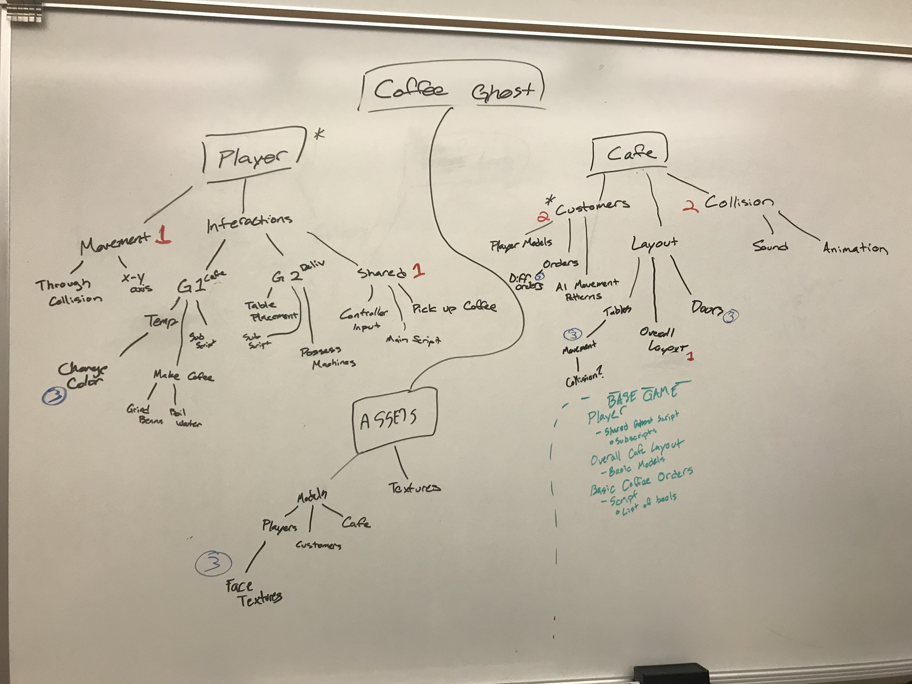

## 11/20/19
#### Github/Workflow update: 
After attempting to fix our 4 Git Branches and resolve some merge conflicts because of stupid config file errors, we decided that moving forward, it would be best to work on a single master repo, and just be consciousness and communicative of who is pushing/pulling to the master branch at any given time. Should we have merge conflicts, we'll deal with them on a case by case basis. The important thing is that we're all going to *finally* be working on a single build of the game so we can actually make some forward progress. Luckily, we've all worked on our various portions of this separately on our own branches/systems, so we made progress. 

#### What we've accomplished as of today: 
* basic Ghost asset created and imported into Unity, fixed temporary shader 
* coffee + plate Assets + Textures imported to Unity
* wrote a script to control the x/y movement of the player object
* Basic movement+ collision through walls (still in progress)
* Basic customer movement scripts 

#### What we did during the work day today:
Today, we continued to work on CoffeeGhost and worked to merge all of our separate changes onto a single build (*finally!*). 
We currently have a basic customer script that deals with tables, a basic ghost asset with a coffee, a movement script, and a basic map with basic collision. We also did a lot of planning in terms of the scope of how the collisions, customer logic, and coffee logic will work. (Seperate scripts still need to be written) 

#### Where we're headed: 
--Big Tasks for next time:
* Add tables to the layout so Hai can put her scripts- Jake 
* Make basic customer assets - Jake 
* Build the rest of the assets, add textures and shaders - Jake
* Build a script to pick up, put down, and DROP the coffee - Jake 
* Custom shader for the ghost to modify color - Jake  (yes, I know it's a lot, but I have some time this weekend to finish all the assets! And a lot of these are pretty easy to make!) 
* Figure out how to control the ghost with a controller, fix player movement script - Colin
* Make the script work with multiple customers, and have them walk up to the counter, recieve an order, and then walk to a table - Hai 
* Grind Beans, Boil water scripts, more kitchen mechanics - Ethan 

* As a stretch goal, I'd like to have some UI/text bubble elements for orders completed soon as well. This will make scripting the customers and dealing with orders much easier. 

#### Over the break: 
We plan on staying in touch and working on our various tasks throughout the days. We will keep each other updated on when/who is pushing/pulling to the Master branch so we don't worry about merge conflicts. We will also meet up (over Discord screenshare) at some point over the break if we need to. This will probably important for scoping/planning how certain scripts/pieces are going to fit together.

We'll keep updating this repo as we make changes. Stay tuned!! 

## 11/13/19

Attempted to deal with the crazy github repo and pull requests. Unsuccessful...

--- 

## 11/12/19

### Gantt Chart + Organization
[Link to our Gantt chart](https://backend.agantty.com/sharing/66e8447066d696076308c4d3f3d854db)

#### Questions to Answer: 
#### What types of libraries might you need?
* It would likely be best to use the standard Unity libraries. Not sure how many extras we'll need... (Maybe some for textures/lightining? Because we're not using Unity share/colab it's probably best to not be dependant upon tons of extra libraries) 
#### What external file formats might you use (for graphics, audio, storytelling, etc)?
* .fbx for models (although this can be adjusted as needed, I just know blender exports fbx's pretty cleanly) - Jake
* .wav for audio (I have some pretty nice audio software where I can create/add/covert any sounds we need) -Jake 
* .png for textures
* Beyond that, I'm not sure we'll be using anything super out of the ordinary for files... 

#### Who will be assigned each specific task?
* See Gantt chart 

### Our Whiteboarded Features/Epic scoping chart: 
Note that 1 denotes highest priority, 2 denotes neccessary but later features, 3 are stretch-goals 
The three epics are **Player, Cafe** and **Assets** and are boxed in 

---

## 11/4/19

### Character Discussion

#### Physical Traits of our Characters
 2 Ghosts -- **Blue & Misty** 
  *  Their own unique Color (one green, one blue?)
  *  No legs - 2 arms
  *  Round, simplistic design
  *  Expressive Faces (faces will change based on what's happening) 
  *  Wear bowties/uniform (one can be wearing apron, the other a bowtie?) 
  *  Move through walls (decisively-corporeal when holding coffee)
  
#### 2 Main Traits 
  *  Hard workers - (died, but still need money) 
  *  Opposite personalities
      * Misty is happy, chill, and content 
      * Blue is bipolar, lashes out, but is methodical  

#### Backstory 
Our coffee ghosts work at a coffee shop (known as *Roasted Soul*) together which burned down. They must work together to make coffee in the afterlife for the newly dead! 
* Blue - this bipolar ghost must get angry/sad before he can heatup/cool down machines (because they can possess). A great cook but hates dealing with people. Very introverted, isn't great at expressing himself without outbursting, coffee is the only thing that can calm him down. *(Maybe he'll upset a customer if he goes through them?)*. In a past life (literally) he was an introverted bartender and good at making drinks, even if he's sick of dealing with people. 

* Misty - the more level-headed one, smart, and can fix various coffee-making appliances, but she's a terrible cook. Usually always smiling. Can't make coffee, but exceptional at customer service and repairs. Much better at dealing with people and staying postiive.  In a past life (literally) she was an engineer, and scientist, but always wanted to work with people and help them.   

Blue and Misty, (real names unknown) before they became ghosts, were friends who bought a dingy coffee shop, which burned down with them inside it. But, even in death, their dream of opening a coffee shop lives on! Now, they decided to fulfil their purpose in the afterlife, each playing to their own unique skills and working together to serve customers. This coffee shop is a temporary purgatory - their customers are newly dead people who can chill out and drink coffee while they wait for the afterlife. The duo is quite happy, and well work together as a pair, with one (Blue) being the more tempremental hot-headed one, the other (Misty) being the more calm and friendly.

---

## 10/30
### In-depth mechanics ideas 
 * would the characters be able to bump into eachother in the ghosting phase? i.e being able to pass through a solid character if one was in a transparent phase, but if both are in transparent phase they will bump into eachother. 
 * haunting function - long press, when pressed ghost haunts -> a repair meter will appear and will go down after a certain time of haunting 
 *CONTROLLER: probably a a controller not keyboard, too many functions for keyboard - might get crowded
 * the game has to be appropriately hard so that we can make sure that the players spill coffee every once in a while. 
 
---

## 10/28
### Core mechanics ideas 
  * Co-op
    * Green and blue ghost either cook or deliver. The delivery ghost is the only one that can possess and fix the machines. The cooking ghost can only control temperature, boil roasts to a specific temperature and keep the freezer/fridge. 
      * pasteries are a stretch goal.
    * Island between kitchen and service area so the ghost has to set the coffee down before the other one can pick it back up/ walk through the wall.
    * Delivery ghost - take orders, clean tables, deliver orders, fix machines, can't walk through tables otherwise spills coffee / throw tables.
    * Cooking ghost - Control temperature of freezer and boiler, roasts beans, makes milk, construct coffee, make pastries?(possibe third player).
  * DO NOT want washing dishes!!!(fourth player rotate joystick to wash dishes)
  * Want more chill than overcooked
    * Keep x number of customers happy. Bonus in time limit?
    
--- 

## Initial Ideas 

### Brainstorming/Inspirations
  * Overcooked, Cooking Mama
### Basic Mechanics
  * Player can go through walls, Coffee can't
  * Co-op?
  * Cook times
    * Pour-over, French Press, Espresso, Aero-press
    * Prep work
      * Milk prep, bakery, Bean prep
  * Kitchen Layout map
    * Obstacles
    * 3-D vs isometric
    * Low-Poly, Coffee Aesthetic
    * Simple textures
    
  * Possess Appliances
    * Appliances break, must haunt to fix. Haunting takes time
    
  * External
    * Hide from ghost checking health inspectors
    * Clean-up ectoplasm to keep machines going
  * Upgrades for the shop
    * Management vs Different environments
    * Shop extensions and menu extensions (Ghost Parfaits, poetry riffoff)
    * Ghost evolution (Faster Ghost meter repair, ectoplasm babies)
 
 Schedule + Core values: https://docs.google.com/document/d/1Wn5cHNnlkw_rQgnP4Xro0Bdj8sZR1zMKozzrnpinn2g/edit?usp=sharing
 
### CORE MECHANICS 
## Core Values: 
 - Chaos 
 - Chill Coffee shop atmosphere
 - Co-op
## Core Mechanics: 
 - Going through walls
   * Player can pass through walls/tables but the coffee they must deliver cannot
   * They must go back and get another cup if they spill one
- Possessing appliances
   * Machines break and players must possess them(long button press?) to repair them
- Time management
  * Players must multitask and strategize to keep as many customers as happy as possible. Customers have a meter that  determines *how long before they become angry
- Multistep recipes
  * Players have to move from station to station in order to produce the coffee(think overcooked)

 
